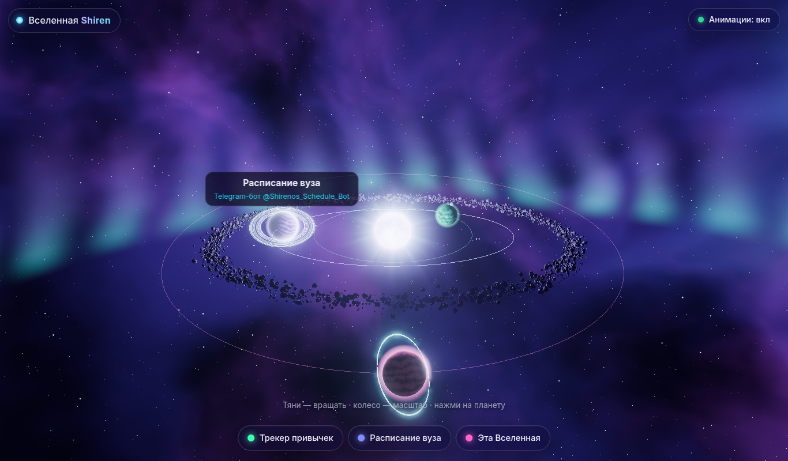
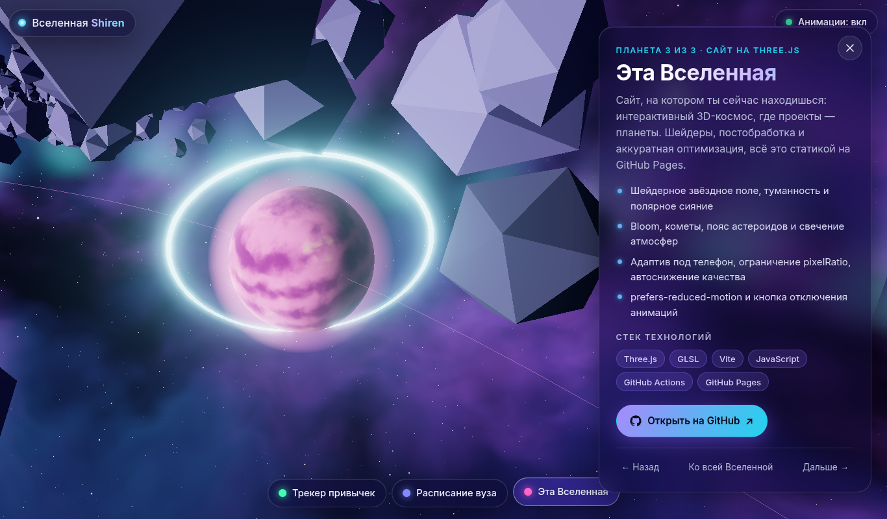
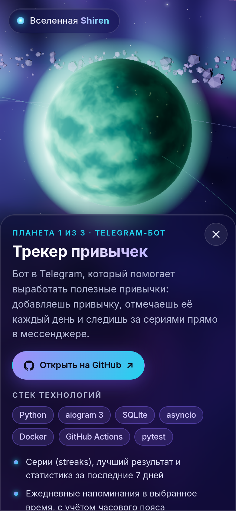

# 🌌 Shiren's Universe

An interactive 3D website built with **Three.js**: dark space, a shader-driven starfield, a nebula and aurora, a glowing core and **project planets** in orbit. Hover over a planet to highlight it and see its label; click it and the camera smoothly flies over while a side panel shows the description, the tech stack and an "Open on GitHub" button.

> The site's user interface is in Russian (the texts you see on the page and in the screenshots below).

**▶ Live version: https://shirenos.github.io/universe/**



| Project panel | Phone |
| --- | --- |
|  |  |

## ✨ What's inside

- **Intro animation** — the camera flies in from deep space, the core ignites, the planets and the title appear (it can be skipped).
- **Starfield** — tens of thousands of particles in a single draw call; twinkling and size are computed in the vertex shader.
- **Nebula** — procedural fBm noise on the sky sphere with indigo → violet → cyan gradients, plus a ribbon of **aurora**.
- **Planets** — procedural surface shaders (no textures), lighting from the core, a fresnel **atmosphere glow**, rings and a moon.
- **Asteroid belt** — `InstancedMesh`, one draw call.
- **Comets** — point-based tails, one draw call.
- **Post-processing** — `UnrealBloomPass` + `OutputPass` (ACES tone mapping).
- **Controls** — `OrbitControls` with inertia, mouse-driven layer parallax, camera flights and touch gestures (swipe / pinch / tap).
- **Accessibility** — keyboard navigation (planet buttons, `Esc`, `←`/`→`), `aria` markup, `prefers-reduced-motion` and an "Animations: on/off" toggle (the choice is remembered).
- No sound. No personal data on the site — public projects only.

## ⚡ Performance

- `pixelRatio` is capped (≤ 2 / 1.5 / 1 depending on the quality level) and further limited by a per-frame pixel budget.
- Three quality levels (`high` / `medium` / `low`) are picked from the device (cores, memory, touch). On `low`, bloom and the aurora are disabled and there are fewer stars and asteroids.
- **FPS watchdog**: if frames are consistently slow, the quality is lowered automatically.
- With "Animations: off" the scene is re-rendered only when needed.
- About 20 draw calls in total (stars, sky, aurora, core, planets, belt, comets — one or two per object).
- If WebGL is unavailable, a plain list of projects is shown instead (fallback).
- Three.js and the Inter font come from `npm` and are bundled locally: **no CDNs**.

Debug URL parameters: `?q=low|medium|high` forces a quality level, `?adaptive=0` disables the FPS watchdog, `?nointro` skips the intro; `#habit`, `#schedule`, `#universe` open the corresponding planet right away.

## 🛠 Stack

Three.js · GLSL · Vite · JavaScript (ES modules) · GitHub Actions · GitHub Pages

## 🚀 Getting started

```bash
npm install
npm run dev       # http://localhost:5173/universe/
npm run build     # static build into dist/
npm run preview   # preview the build at http://127.0.0.1:4173/universe/
```

The build base path is `/universe/` (see `vite.config.js`) because the site is served from a GitHub Pages project repository.

## 📦 Deployment

Every push to `main` triggers the [`deploy.yml`](.github/workflows/deploy.yml) workflow: `npm ci` → `vite build` → publishing `dist/` via GitHub Pages (Actions).

## 🧪 Automated check

`scripts/check.mjs` is a headless check using Chrome and SwiftShader (WebGL without a GPU): it waits until the scene is ready, collects console errors and saves a screenshot.

```bash
node scripts/check.mjs "http://127.0.0.1:4173/universe/?q=high&adaptive=0#habit" shot.png --mode=focus
```

## 📄 License

MIT
